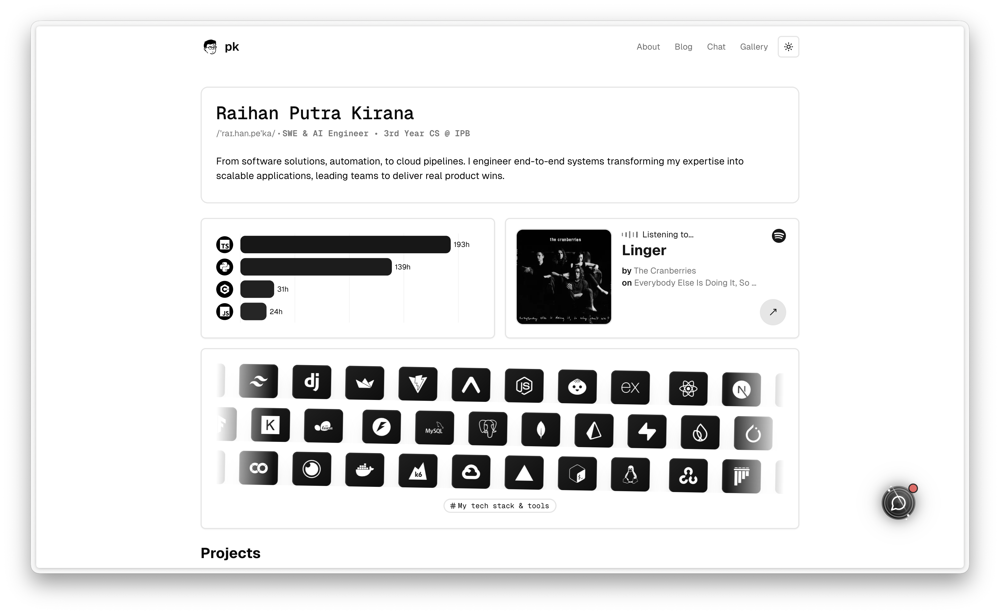

  

# @raihanpka's website

[Website](https://raihanpk.com) &nbsp;&middot;&nbsp; [LinkedIn](https://linkedin.com/in/raihanpk) &nbsp;&middot;&nbsp; [Instagram](https://instagram.com/raihanpka)

### about this repo

Source code for [raihanpk.com](https://raihanpk.com) built with Astro. This website showcases a portfolio, blog, chatbot, and additional features such as Spotify status and Wakatime status.

Additional features were developed from built-in features of the public template [Astro Erudite](https://github.com/jktrn/astro-erudite) by [jktrn](https://github.com/jktrn).

- Chatbot: Personal chatbot that can answer questions about me using Retrieval Augmented Generation (RAG). Built with [LlamaIndex](https://llamaindex.ai) and [OpenAI API](https://openai.com).
- Spotify Status: Displays currently playing and recently played music on [Spotify](https://spotify.com) using the [Spotify](https://spotify.com) and [Last.fm](https://last.fm) APIs.
- Wakatime Status: Integration with [Wakatime](https://wakatime.com) to display coding time analytics across programming languages. This integration allows the website to showcase my four most-used programming languages.

Future development plans:

- Blog: Migration from Markdown to CMS using [Sanity CMS](https://sanity.io).

---

### tech stack (used in this project)

- This site is built with [Astro](https://astro.build), [React](https://react.dev), and [TypeScript](https://www.typescriptlang.org), styled with [Tailwind CSS](https://tailwindcss.com) and deployed on [Vercel](https://vercel.com).

- The content layer uses MDX plus Astro integrations for sitemap, RSS, markdown remarking, and search-friendly rendering. The chatbot stack relies on [AI SDK](https://ai-sdk.dev), [OpenAI](https://openai.com), [LlamaIndex](https://www.llamaindex.ai), and [Prisma](https://www.prisma.io) for data access.

- UI and interaction pieces use a smaller set of libraries from the actual app codebase: [`Radix UI`](https://www.radix-ui.com), [`Lucide Icons`](https://lucide.dev), [`Framer Motion`](https://www.framer.com/motion), [`Recharts`](https://recharts.org), [`clsx`](https://github.com/lukeed/clsx), [`class-variance-authority`](https://github.com/pacocoursey/class-variance-authority), and [`tailwind-merge`](https://github.com/lukeed/tailwind-merge).

Copyright &copy; 2026 Raihan Putra Kirana. All rights reserved.

