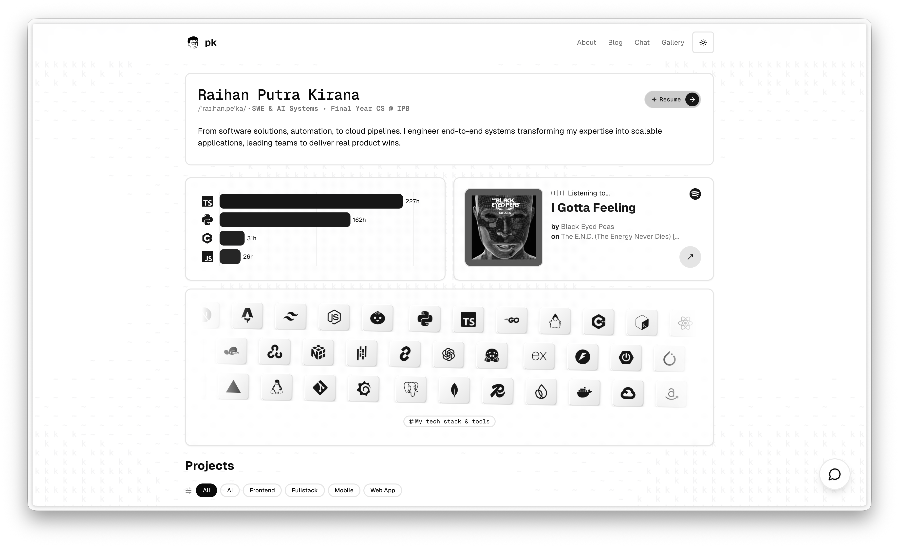
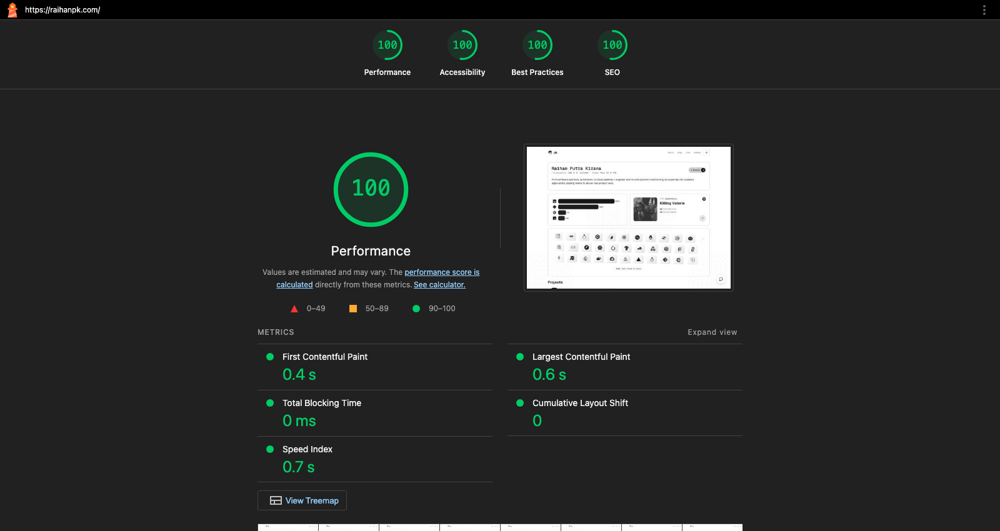

  

# @raihanpka's website

[Website](https://raihanpk.com) &nbsp;&middot;&nbsp; [LinkedIn](https://linkedin.com/in/raihanpk) &nbsp;&middot;&nbsp; [Instagram](https://instagram.com/raihanpka)

### about this repo

Source code for [raihanpk.com](https://raihanpk.com) built with Astro. This website showcases a portfolio, blog, AI chatbot assistant, and interactive widgets such as live Spotify presence, Wakatime coding analytics, and an interactive project showcase.

Additional features developed from built-in features of the public template [Astro Erudite](https://github.com/jktrn/astro-erudite) by [jktrn](https://github.com/jktrn):

- **AI Chatbot**: Personal conversational assistant answering questions using Retrieval-Augmented Generation (RAG) with [Pinecone Vector DB](https://pinecone.io), [Google Gemini / OpenAI](https://ai-sdk.dev), and [Vercel AI SDK](https://sdk.vercel.ai).
- **Spotify Status**: Real-time live presence displaying currently playing and recently scrobbled tracks using [Spotify](https://spotify.com) and [Last.fm](https://last.fm) APIs with SWR caching.
- **Wakatime Analytics**: Weekly coding time breakdown across languages directly from the [Wakatime API](https://wakatime.com) with dynamic dark/light mode icons.
- **Projects Showcase**: Interactive portfolio grid featuring smooth media video previews, modal dialogs, and responsive category filtering.
- **Tech Stack Slider**: 3D-sculpted marquee slider displaying programming languages, frameworks, and cloud infrastructure tools.
- **Blog & View Counter**: MDX content collections with live view counter persistence backed by [PostgreSQL](https://postgresql.org) and [Prisma Accelerate](https://www.prisma.io/accelerate).
- **High Performance**: Optimized for Core Web Vitals (100 Lighthouse score across Performance, Accessibility, Best Practices, and SEO) featuring font preloading, responsive WebP asset compression, and lazy loading.

  

---

### tech stack

- **Framework & Core**: [Astro](https://astro.build), [React](https://react.dev), [TypeScript](https://www.typescriptlang.org)
- **Styling**: [Tailwind CSS](https://tailwindcss.com), [Tailwind Animate](https://github.com/jamiebuilds/tailwindcss-animate)
- **Database & ORM**: [PostgreSQL](https://postgresql.org), [Prisma ORM](https://prisma.io) with [Prisma Accelerate](https://www.prisma.io/accelerate)
- **Vector & AI**: [Pinecone](https://pinecone.io), [Vercel AI SDK](https://sdk.vercel.ai), [Google Generative AI](https://ai.google.dev), [OpenAI](https://openai.com)
- **UI Components & Animation**: [Radix UI](https://www.radix-ui.com), [Lucide Icons](https://lucide.dev), [React Icons](https://react-icons.github.io/react-icons), [Framer Motion](https://www.framer.com/motion), [Recharts](https://recharts.org), [@devnomic/marquee](https://github.com/devnomic/marquee)
- **Deployment**: [Vercel](https://vercel.com)

Copyright &copy; 2026 Raihan Putra Kirana. All rights reserved.

