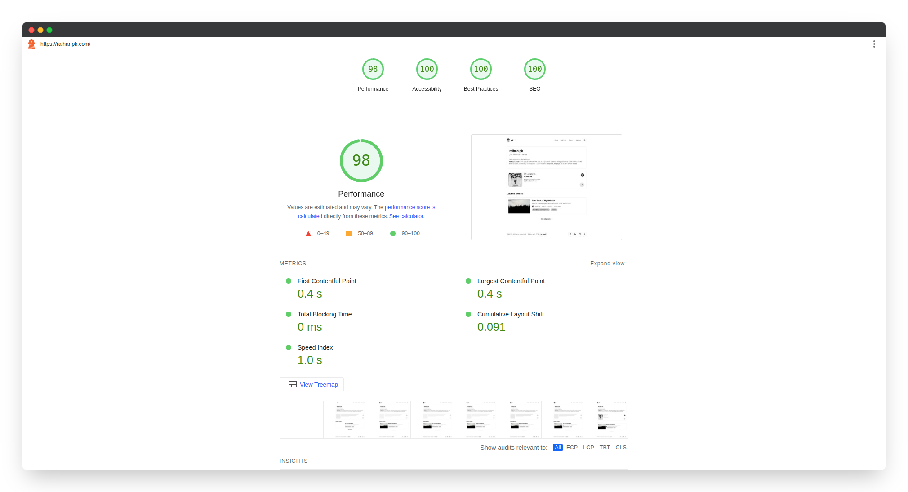

## Hey, everyone.

It feels like it's been a minute since I last posted anything here on [raihanpk.com](https://raihanpk.com).

Lately, I've been diving deep back into **web development** and tinkering with my site again. I actually just did a complete revamp of this digital space—migrating entirely from [Next.js](https://nextjs.org) over to [**Astro**](https://astro.build). 

*Wait, why?* Hold that thought, because I'm about to break down exactly why I made the switch.

## Next.js vs Astro: The Framework Shift

Before jumping into **Astro**, my go-to was always **Next.js** for building sites, including this one. 
It’s a brilliant framework, especially with its powerful **SSR (Server-Side Rendering)** for dynamic applications. 
But here’s the catch... my website is essentially purely static. I mean, why was I using a heavy framework like **Next.js** just to serve articles and a portfolio? Total overkill, right?

I actually stumbled upon it while scrolling through the [IPB Web Development Community (IWDC)](https://instagram.com/iwdc_ipb) WhatsApp group from my campus. 
An alumni was talking about **Astro** right around the time it got a major update. 
The one review that stuck with me was: "**Astro** is incredibly lightweight and way faster than other **React/JS-based** frameworks." 

Recently, while casually browsing *GitHub*, I found a bunch of clean Astro templates and finally decided to give it a shot. 
Astro steps away from the heavy React/JS-centric wave. 
At its core, it's a **static site generator** hyper-focused on performance without the unnecessary complexity. That alone sold me on it.

Here are the main reasons why I made the move to **Astro**.

## Why I Moved On to Astro

### 1. Zero JavaScript, By Default

Astro is practically **pure magic**. Everything renders down to static HTML on the server. 
**JavaScript** is only loaded when absolutely necessary (a concept they call [partial/selective hydration](https://docs.astro.build/en/concepts/islands)). 
Compare that to **Next.js**, which defaults to sending large JS bundles that can drag down load times. 
Since migrating to **Astro**, my average *Lighthouse* score is comfortably sitting at **95+**!

<figure>

<figcaption>
Lighthouse Score
</figcaption>
</figure>

### 2. Multi-Framework Freedom

If you're still attached to **React**, don't worry. **Astro** lets you *mix and match* components from **React**, **Vue**, **Svelte**, and even **vanilla JS** in a single project. 
You can use React components for the interactive bits and rely on other frameworks or pure HTML for the rest. 
It’s incredibly flexible. **Next.js**? You’re locked into React.

### 3. Speed is the Key

According to HTTP Archive data, **90% of websites fail to optimize for speed** (https://httparchive.org/reports/state-of-the-web#bytesTotal). 
Astro completely bypasses that statistic. With its static file output and smooth caching system, this site now loads ridiculously fast.

## Next.js Isn't Bad, But…

Don't get me wrong, **Next.js** is still arguably the best framework out there for highly dynamic sites like e-commerce or real-time applications. 
But for a static blog or a minimalist space like mine? **Astro** just makes more sense. **Less code, less complexity, more speed.**

> Fun fact: Many companies like **Netlify** or **Cloudflare** uses Astro for their developer documentation even landing page site.

## Final Thoughts

So, if you're looking to build a blog or develop a portfolio, I highly recommend giving **Astro** a try. 
It feels like a tool that doesn't force you to follow the hype, but rather focuses entirely on what you actually need. 
**No more over-engineering.** What about you? Ready to make the switch?

---

Image: [Unsplash](https://unsplash.com/photos/silhouette-of-trees-CqVFAFG7nFU)