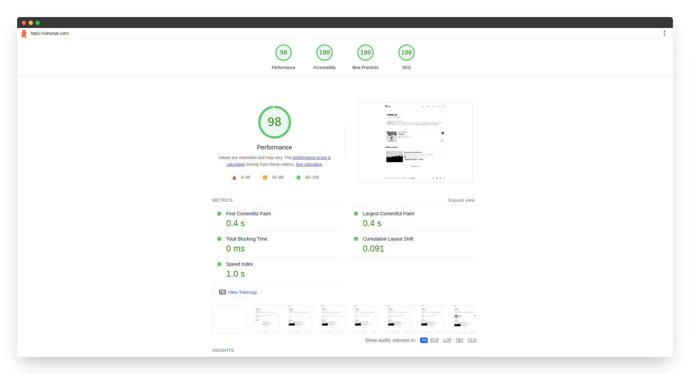

## Halo, Guys!

Kayaknya, udah lama banget ya dari terakhir kali aku posting sesuatu di website [raihanpk.com](https://raihanpk.com) ini, *hehehe*.

Bisa dibilang, sekerang ini aku lagi senang-senangnya menjelajah dunia **web development** dan ngoprek-ngoprek website aku lagi deh, wkwkwk. Soalnya, baru aja aku melakukan *revamp* total website aku ini—yang tadinya menggunakan [Next.js](https://nextjs.org), sekarang migrasi 100% ke [**Astro**](https://astro.build)! 

*Wait, why?* Simpan dulu pertanyaan itu, karena aku bakal bocorin alasan di balik glow-up website aku ini!

## Next.js vs Astro: Battle of Web Frameworks

Sebelum pakai framework **Astro**, selama ini aku biasanya pakai **Next.js** untuk buat website, seperti website aku ini. 
Framework yang keren, apalagi fitur **SSR (Server-Side Rendering)**-nya yang *powerful* untuk website dinamis. 
Tapi, masalahnya… website yang aku tuh selama ini adalah blog statis! Maksudku, untuk apa menggunakan *heavy framework* seperti **Next.js** kalau cuma dipakai untuk menampilkan artikel dan portofolio? *Overkill*, nggak sih?

Nah, kebetulan saat aku buka grup Whatsapp komunitas [Web Development (IWDC)](https://instagram.com/iwdc_ipb) dari kampus aku, ada salah satu alumni yang sharing tentang framework **Astro** ini. 
Intinya waktu itu, saat **Astro** baru banget dapat *major update*, salah satu review dari alumni yang aku ingat banget saat itu katanya **Astro** adalah framework yang enteng dan ngebut daripada framework *React/JS based* lainnya. 

Baru deh pada kesempatan kali ini, saat aku iseng-iseng scroll *GitHub*, aku menemukan banyak template website buat **Astro** dan akhirnya aku jadi penasaran buat coba. 
Nah **Astro** ini merupakan *framework* baru yang tidak ikut arus *JS* lainnya yang bisa dibilang cukup berat. 
Intinya, **Astro** adalah **static site generator** yang fokus pada performa tanpa ribet. Inilah salah satu alasan yang buat aku langsung suka sama framework ini!

Berikut ini beberapa alasan, mengapa aku pindah ke **Astro**!

## Alasan aku Move On ke Astro 🚀

### 1. Zero JavaScript, By Default

Astro itu **pure magic**! Intinya semua komponen nya itu di-*render* menjadi HTML secara statis di sisi servernya. 
**JavaScript** nya hanya akan di-*load* jika memang dibutuhkan (disebut [partial/selective hydration](https://docs.astro.build/en/concepts/islands)). 
Coba bandingkan dengan **Next.js** yang secara default mengirim *bundle JS* dalam skala besar, sehingga membuat *loading time* menjadi lebih lambat. 
Setelah pindah ke **Astro**, hasilnya skor rata-rata *Lighthouse* website aku sekarang mencapai **95+** cuy!

<figure>

<figcaption>
Lighthouse Score
</figcaption>
</figure>

### 2. Multi-Framework Freedom

Kalau kamu masih nyaman dengan **React**, tenang aja kok! **Astro** bisa *mix and match* komponen **React**, **Vue**, **Svelte**, bahkan **vanilla JS** dalam satu proyek. 
Jadi kamu bisa aja menggunakan beberapa *base* komponen dari **React** untuk bagian yang membutuhkan interaktivitas, sementara sisanya bisa kombinasi dengan framework lainnya. 
Fleksibel sekali, bukan? Kalau **Next.js**? Ya, hanya bisa pakai **React**.

### 3. Speed is The Key (Kecepatan adalah Kunci)

Menurut data dari HTTP Archive, **90% website gagal mengoptimalkan kecepatan** (https://httparchive.org/reports/state-of-the-web#bytesTotal). 
Nah, **Astro** ini nggak mau ikut-ikutan! Dengan sistem output file statis dan *caching* nya yang smooth, akhirnya website aku ini *loading*-nya jadi secepat balapan F1 (_du-du-du-du_).

## Next.js Tidak Jelek, Tapi…

Jangan salah, menurutku **Next.js** tetap menjadi *framework* terbaik untuk website yang dinamis seperti *e-commerce* atau aplikasi real-time. 
Tapi untuk blog statis atau website minimal seperti punya aku? kayaknya **Astro** lebih masuk akal deh. **Less code, less complexity, more speed!**

> Fun fact: **Netlify** aja pakai Astro untuk bagian website dokumentasi mereka loh...

## Closing Statement

Jadi, jika kamu pengen belajar buat website seperti blog atau pengen ngembangin portofolio, nggak ada salahnya menurut aku untuk coba pakai atau switch ke **Astro**. 
Menurut aku, **Astro** itu seperti teman yang tidak memaksa kamu mengikuti tren, tetapi lebih fokus pada kebutuhanmu sendiri, *cihuy*.
**No more over-engineering!** 

Jadi gimana? Sudah siap move on dari *framework* lainnya?

---

Gambar: [Unsplash](https://unsplash.com/photos/silhouette-of-trees-CqVFAFG7nFU)
